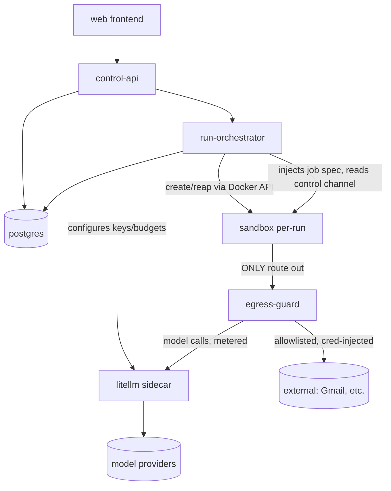
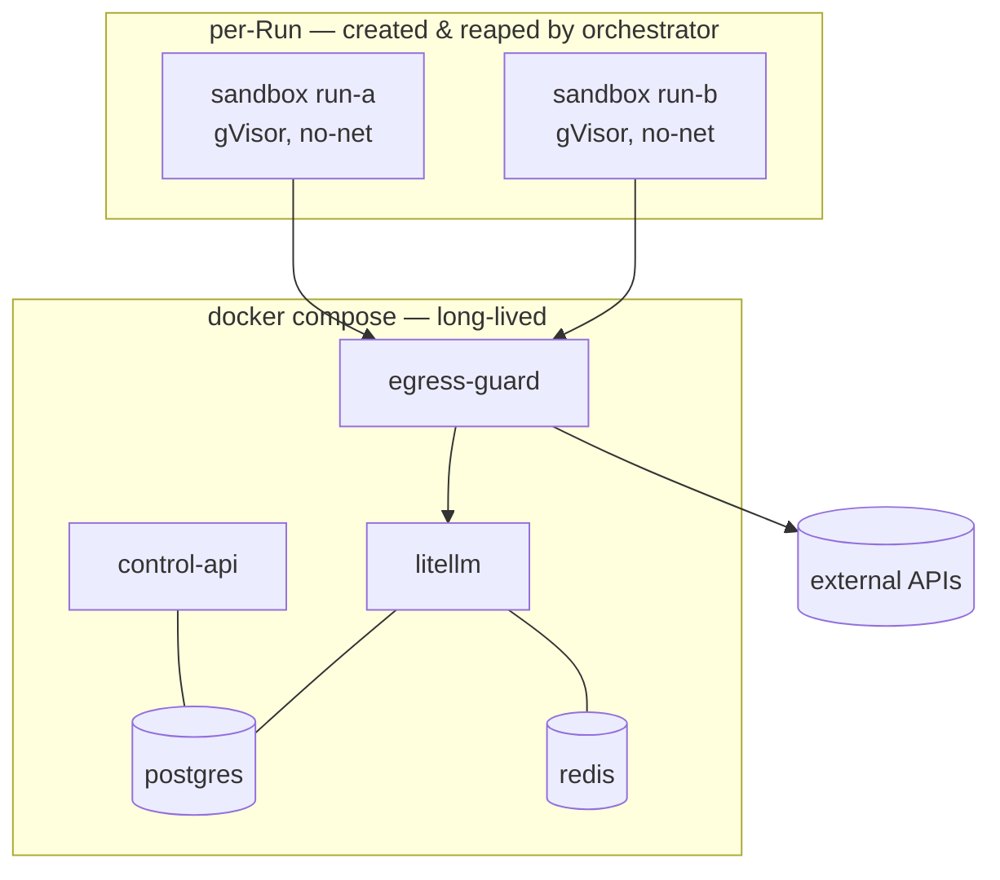
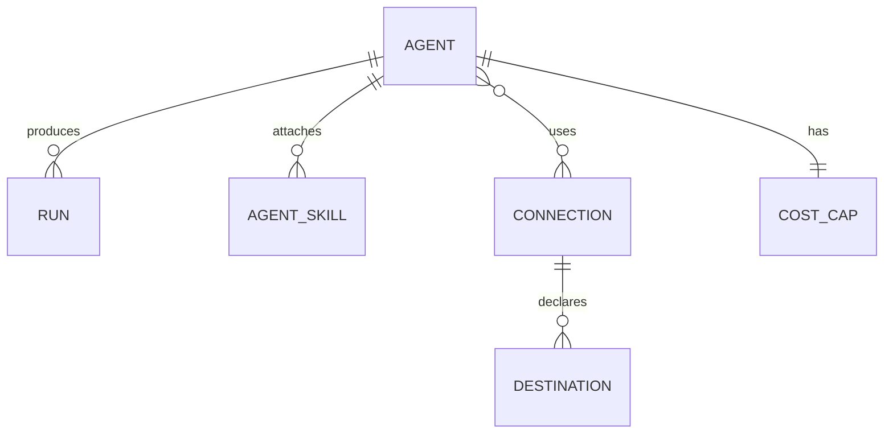

# Architecture Spine — turanga

## Design Paradigm

**Control plane / execution plane split with a mediating Guard broker.** Three planes, and the security guarantees are *topological* — true because of the wiring, not because code remembers to check:

- **Control plane** (trusted) — UI + control API, agent/connection management, lifecycle, the run-orchestrator. Owns the database of record.
- **Execution plane** (untrusted) — ephemeral, per-Run sandboxes where agents actually run. No direct network, no direct DB.
- **Guard broker** (the only wire out) — every model call and every byte of egress passes through it.

Component → area mapping:

| Plane | Components |
| --- | --- |
| Control plane | `web` (frontend), `control-api`, `run-orchestrator` |
| Guard broker | `egress-guard` (allowlist + credential injection + filter hook), `litellm` (model gateway, sidecar) |
| Execution plane | `sandbox` (per-Run container: gVisor runtime, `--network=none`) running the `agent-harness` |
| State | `postgres` (record of truth), `redis` (cost meter accounting, owned by litellm) |

## Invariants & Rules

Dependency direction (who may depend on whom — an arrow means "may call / depend on"):



*Rule: the sandbox has exactly one outbound edge — to `egress-guard`. It has no edge to `postgres`, the internet, or `control-api`.*

### AD-1 — Control/execution plane split with a mediating Guard broker *(ADOPTED)*
- **Binds:** all — every unit's placement.
- **Prevents:** security-by-discipline drift; a sandbox with direct network/DB access could bypass egress/cost controls.
- **Rule:** agents run only in ephemeral per-Run sandboxes with no direct network and no direct DB; the Guard broker is the sole path out. FR-7/8/9/10/12 are enforced topologically.

### AD-2 — Guard is a single choke point, two policy modules
- **Binds:** FR-8, FR-10, FR-12; all sandbox egress.
- **Prevents:** a second escape path / two boundaries to prove.
- **Rule:** all outbound flow traverses one broker, which classifies it — Model-Provider destination → cost meter + kill (via `litellm`); any other → default-deny allowlist + filter hook. Cost and allowlist logic are separate modules behind one path.

### AD-3 — All-TypeScript first-party code; LiteLLM the only non-TS box *(ADOPTED)*
- **Binds:** `web`, `control-api`, `run-orchestrator`, `egress-guard`, `agent-harness`.
- **Prevents:** split-language sprawl.
- **Rule:** no Python in first-party code. `litellm` runs as an operated sidecar, never authored. Frontend is Next.js **or** SvelteKit (see Deferred).

### AD-4 — Two deployment tiers; one ephemeral container per Run
- **Binds:** deployment; every Run's isolation.
- **Prevents:** shared-runtime state bleed across concurrent Runs (FR-7); an idle sandbox fleet.
- **Rule:** long-lived services (`control-api`, `egress-guard`, `litellm`, `postgres`, `redis`) run via docker compose. Sandboxes are **not** in compose — the orchestrator creates one per Run via the Docker API with `--runtime=runsc` (gVisor) and `--network=none`, and reaps it on completion. Agents never run outside a fresh per-Run gVisor container.

### AD-5 — Egress guard: two modes, credential isolation *(ADOPTED)*
- **Binds:** FR-8, FR-9, FR-10; credential custody.
- **Prevents:** agent-visible secrets; ad-hoc egress paths; the SNI-vs-credential-injection contradiction.
- **Rule:** the guard is the sandbox's only route out and runs in two modes. **(a) Credentialed-connection gateway** — for an attached Connection, the harness issues a *logical* request; the guard terminates TLS, attaches the held credential, forwards over its own TLS; filter hook runs here. **(b) Plain allowlisted egress** — CONNECT tunnel, SNI/host allowlist, no creds, opaque body; filter hook at connect-time. Allowlist = union of the Agent's attached Connections' declared destinations (default-deny) + optional explicit per-agent additions. The agent never holds a raw credential.

### AD-6 — LiteLLM is the cost-enforcement point; one owner for config, one for spend *(ADOPTED)*
- **Binds:** FR-11, FR-12, NFR-3.
- **Prevents:** cap-number drift; a spend guarantee that secretly depends on a cooperative harness.
- **Rule:** every model call carries a per-agent virtual key holding the daily budget; the per-run cap is a short-lived per-run key minted under it. **Spend cannot be exceeded because LiteLLM 429s the call** regardless of harness behavior. The orchestrator's kill on 429 merely *reaps* a run that can no longer progress. Cap **configuration** is owned by `control-api` (pushed into LiteLLM keys); **spend** is owned by `litellm` (Postgres/Redis) and only read elsewhere. MVP trusts LiteLLM enforcement; reserve-then-reconcile hardening is Deferred.

### AD-7 — One owner per entity (single-writer)
- **Binds:** all persisted state.
- **Prevents:** two-writer conflicts on shared data.
- **Rule:** `control-api` is the sole writer of Agent and Connection state; `run-orchestrator` is the sole writer of Run state; **nobody** writes spend — `litellm` owns it, all others read.

### AD-8 — Lifecycle: two resting states, deterministic transitions *(ADOPTED)*
- **Binds:** FR-4, FR-5, FR-6, FR-18.
- **Prevents:** ambiguous promotion; holding an ephemeral container open on human latency.
- **Rule:** resting Agent states are **Draft** and **Active** (Test is an execution mode, not a resting state). Only transitions: **Activate** (Draft→Active, gated: model selected + per-run and per-day caps set) and **Deactivate** (Active→Draft), both control-plane actions. Run lifecycle: `created → running → (succeeded | failed | killed)`, mutated only by the orchestrator. Send-gated actions produce an artifact and the Run **completes**; approve/send is a separate control-plane action. Mid-run `review` (human-in-the-loop pause) is Deferred.

### AD-9 — Immutable job spec in, single control channel out
- **Binds:** FR-9; the control-plane ↔ harness contract.
- **Prevents:** a harness guessing the job shape; a self-mutating agent; side-channel ingress.
- **Rule:** at Run start the orchestrator injects an **immutable job spec** (snapshot of agent definition + task input) — a versioned contract owned by `control-api`. The agent cannot mutate its own definition mid-run. The harness emits structured events/results on **one** control channel to the orchestrator; it has no other I/O. Runtime data ingress (e.g. email contents) is **proxy-mediated Connection reads only** (FR-9), never a side channel.

### AD-10 — No secret ever enters a sandbox
- **Binds:** NFR-5; credential custody; SM-2.
- **Prevents:** exfiltration of secrets by a compromised agent.
- **Rule:** provider API keys are held by `litellm`; data-connection OAuth tokens are held by `egress-guard`; both encrypted at rest. The sandbox holds only its job spec.

## Consistency Conventions

| Concern | Convention |
| --- | --- |
| Naming | Glossary terms verbatim (Agent, Connection, Run, Sandbox, Guard, Allowlist, Filter Hook, Cost Cap, Lifecycle State). Components in kebab-case (`control-api`, `egress-guard`, `run-orchestrator`, `agent-harness`). |
| IDs | Opaque string IDs (ULID) per entity; job-spec and control-channel messages carry `runId` + `agentId`. |
| Dates / money | UTC ISO-8601 timestamps; money as integer minor units + currency; token/latency/cost surfaced as mono/tabular per Warm Ink (NFR-6). |
| Error / refusal shape | Guard/permission refusals are structured records attached to the Run (destination attempted, reason) — never silent (FR-8, NFR-4). |
| State mutation | Single-writer per entity (AD-7). All Agent/Connection mutation via `control-api`; all Run mutation via `run-orchestrator`. |
| Fail-closed | Any Guard error or sandbox-establish failure → refuse/fail, never fall through to unsandboxed or unmetered execution (NFR-1, NFR-2). |
| Auth | Single-user session (email+password, FR-16); the control API is the only authenticated surface. |

## Stack

*Seed — verified current at authoring (mid-2026); re-verify at build time. The code owns this once it exists.*

| Name | Version |
| --- | --- |
| TypeScript / Node | Node 22 LTS |
| SvelteKit (frontend) *(bound at build start; Svelte 5 runes)* | @sveltejs/kit 2.69.x |
| Hono (control-api, egress-guard services) | 4.12.x |
| pnpm workspaces (monorepo; add Turborepo only if build times hurt) | pnpm 11.18.x |
| LiteLLM (model gateway sidecar; image `litellm/litellm-database`, pin immutable tag) | v1.94.1 |
| Docker + gVisor (`runsc`) | current |
| PostgreSQL | 17.x |
| Redis | 8.x |

## Structural Seed

Deployment (single machine, NFR-5):



Core entities (names + relationships; attribute-level invariants are ADs, not shown):



Minimal source tree (scaffold, not a mirror):

```text
turanga/
  apps/
    web/            # frontend (Next.js or SvelteKit) — Warm Ink UI
    control-api/    # control plane: agents, connections, lifecycle, orchestrator
    egress-guard/   # the Guard: allowlist, credential injection, filter hook
    agent-harness/  # runs INSIDE each sandbox; job-spec in, control-channel out
  packages/
    contracts/      # job-spec + control-channel schemas (versioned, control-api owns)
    domain/         # Glossary entities shared across TS apps
  deploy/
    compose.yaml    # long-lived services (not sandboxes)
```

## Capability → Architecture Map

| Capability / FR area | Lives in | Governed by |
| --- | --- | --- |
| Agent definition, skills, permissions (FR-1..3, FR-17..18) | `control-api`, `agent-harness` | AD-3, AD-7, AD-9 |
| Lifecycle & testing (FR-4..6) | `control-api`, `run-orchestrator` | AD-8 |
| Sandboxed execution + Guard (FR-7..10) | `run-orchestrator`, `sandbox`, `egress-guard` | AD-1, AD-2, AD-4, AD-5 |
| Cost governance (FR-11..12) | `egress-guard`, `litellm`, `control-api` | AD-2, AD-6 |
| Connections & central mgmt (FR-13..15) | `control-api`, `egress-guard` | AD-5, AD-7, AD-10 |
| Access (FR-16) | `control-api`, `web` | Conventions (Auth) |

## Deferred

- **Frontend framework** — ~~Next.js vs SvelteKit~~ **bound to SvelteKit** (Svelte 5 runes) at build start, 2026-07-31; no ripple into the security architecture.
- **Adversarial egress monitor** — MVP is default-deny allowlist + filter hook; the injection-resistant reference monitor (the roadmap moat) drops in at the filter hook without rework (AD-5).
- **Reserve-then-reconcile cost hardening** (NFR-3) — MVP trusts LiteLLM budgets; own-accounting overlay is roadmap given solo/low-concurrency (AD-6).
- **Mid-run `review` / human-in-the-loop** — needs Run continuation across ephemeral containers; roadmap (AD-8).
- **Stronger isolation** — gVisor is the MVP baseline; Firecracker/E2B only if outgrown (AD-4).
- **Multi-user / roles, workflows + eventing, self-learning, MCP marketplace, model routing, local inference, second connector** — all product roadmap per the PRD; each is a separate build.
- **Gmail OAuth scopes, default cap amounts, allowlist authoring UX** — PRD open questions; resolve at feature/epic altitude.
