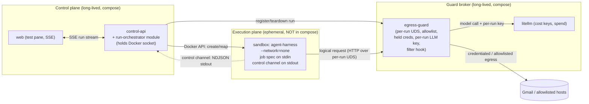

# Epic 4 — Sandboxed Execution & the Guard

**Scope.** The execution plane: running an agent inside a per-run sandbox that reaches only allowlisted destinations, is metered live and killed on breach, with every action + refusal observable. This spine fixes only the invariants stories **4.1–4.6** must share; the parent spine's paradigm + AD-1…AD-10 are inherited, binding, and not re-decided here.

**The one job Epic 4 adds to the parent:** the parent fixed *that* agents run in per-run gVisor sandboxes behind one Guard with a single control channel. Epic 4 fixes *how the wires actually connect* — the transport for egress, the transport for the control channel, the runtime abstraction (so a gVisor-less dev box can't silently become the security posture), Docker-socket custody, the cost-kill path, and the filter seam.

## Inherited Invariants (binding, read-only — parent AD IDs, never renumbered)

- **AD-1** control/execution split; the Guard broker is the sole path out; sandboxes have no direct network/DB (enforcement is topological).
- **AD-2** the Guard is one choke point with two policy modules: model-provider destination → cost meter + kill (via `litellm`); anything else → default-deny allowlist + filter hook.
- **AD-3** all-TypeScript first-party code; `litellm` is the only non-TS box.
- **AD-4** one ephemeral container per Run via the Docker API, `--runtime=runsc` (gVisor) + `--network=none`, reaped on completion; sandboxes are **not** in compose.
- **AD-5** the Guard runs two modes — (a) credentialed-connection gateway (terminates TLS, attaches the held credential), (b) plain allowlisted CONNECT egress — filter hook at both; allowlist = attached Connections' destinations (default-deny) + explicit additions; the agent never holds a raw credential.
- **AD-6** LiteLLM is the cost-enforcement point: a per-agent daily-budget key + a per-run key; a 429 caps spend regardless of harness behavior; `control-api` owns cap config, `litellm` owns spend, all others read.
- **AD-7** single-writer: `control-api` owns Agent + Connection state; the **run-orchestrator owns Run state**; nobody writes spend.
- **AD-8** lifecycle Draft/Active; Run: `created → running → (succeeded | failed | killed)`, mutated only by the orchestrator; a send-gated action produces an artifact and the Run completes.
- **AD-9** an immutable job spec goes in (a `control-api`-owned versioned contract); **one** control channel comes out; the harness has no other I/O; runtime data ingress is proxy-mediated Connection reads only.
- **AD-10** no secret ever enters a sandbox: provider keys live in `litellm`, OAuth tokens in `egress-guard`, both encrypted at rest; the sandbox holds only its job spec.

A new decision below that appears to weaken any inherited AD is a conflict to surface, not a local override. (None here do; E4 decisions are additive mechanism.)

## Topology (per run)

The sandbox has **exactly two wires**: `stdout` (control channel out → orchestrator) and a bind-mounted **Unix-domain socket** (egress → Guard). No network interface. `stdin` carries the immutable job spec in.

## Epic 4 Decisions

### E4-AD-1 — Egress is a per-run Unix-domain socket to the Guard *(the crux)*
- **Binds:** AC-4.1 (`--network=none`), AD-1, AD-5; every sandbox↔Guard call.
- **Prevents:** a network interface on the sandbox; one run reaching another run's Guard context; the `--network=none`-vs-"Guard is the way out" contradiction.
- **Rule:** the sandbox runs with **no network** (`--network=none`) and its **only** egress is a **per-run bind-mounted UDS** to `egress-guard`. The harness speaks HTTP-over-UDS; the Guard classifies each logical request (AD-2/AD-5). At run start the orchestrator **registers the run** with the Guard over the compose network (Guard admin API), which provisions the per-run socket + the run's allowlist + per-run LLM key; the orchestrator bind-mounts that socket into the sandbox; the Guard tears it down on run end. One socket per run — isolation is by socket, not a shared socket + token.

### E4-AD-2 — Job spec on `stdin`, the single control channel on `stdout`
- **Binds:** AD-9; the orchestrator↔harness contract.
- **Prevents:** a second control path; conflating egress with the control channel.
- **Rule:** the orchestrator injects the immutable job spec on the container's **`stdin`**; the harness emits the **one** control channel as **newline-delimited JSON on `stdout`**, which the orchestrator streams and validates against `ControlChannelMessageSchema` (`turn | metrics | refusal | done`). The Guard UDS is **egress-only**; `stderr` is diagnostic logging, never control. The harness has no other I/O (AD-9).

### E4-AD-3 — One `SandboxRuntime` interface, runtime chosen by explicit config, fail-closed
- **Binds:** AD-4; NFR-1, NFR-2; every environment the platform runs in.
- **Prevents:** a gVisor-less box silently becoming the security posture; a run that "works" without isolation.
- **Rule:** a single `SandboxRuntime` interface (`establish(jobSpec, guardSocketPath) → { controlStream, kill(), reap() }`) with impls selected by an explicit `SANDBOX_RUNTIME` config value — **`gvisor`** (`--runtime=runsc --network=none`) for production, **`dev-insecure`** (plain `runc`, still `--network=none` + the same UDS + stdio, **no kernel isolation**) for gVisor-less dev. `dev-insecure` **refuses to boot when `NODE_ENV=production`** and logs a loud warning on every run. **Fail-closed:** if the configured runtime cannot establish a sandbox, the Run **fails with a stated reason — never a silent downgrade** to a weaker runtime. The dev runtime is used only when explicitly named, never as a fallback. (Consequence: the egress/cost *topology* is verifiable on any Docker host; only the kernel-isolation *guarantee* requires a Linux + gVisor host.)

### E4-AD-4 — The run-orchestrator is a control-api module; the Docker socket lives only there
- **Binds:** AD-7 (Run single-writer), AD-4; Docker-API custody.
- **Prevents:** a sandbox holding the Docker socket (= full host escape); a second writer of Run state.
- **Rule:** the **run-orchestrator is a module inside `control-api`** (control plane; the sole writer of Run state). It holds the Docker API client. The **Docker socket is mounted only into `control-api`** and **never into a sandbox**. (MVP co-locates the orchestrator behind a clear module boundary so it can be extracted to its own service without changing these invariants.)

### E4-AD-5 — The per-run LiteLLM key is held by the Guard; a 429 reaps the Run
- **Binds:** AD-6, AD-8, AD-10; cost enforcement + kill.
- **Prevents:** a spend secret in the sandbox; a cap that depends on a cooperative harness.
- **Rule:** at run start the orchestrator mints a **per-run LiteLLM key** (child of the agent's daily-budget key) with the per-run cap as its budget, and hands it to the **Guard** (never the sandbox — AD-10). The Guard attaches that key when forwarding a model call to `litellm`. On a **429**, the Guard signals the orchestrator, which **reaps the sandbox and marks the Run `killed`** within one model round-trip. The live meter reads spend from `litellm` (AD-6); the persisted Run summary must equal the summed run metrics (no drift).

### E4-AD-6 — The Filter Hook is a synchronous Guard interface, no-op by default
- **Binds:** AD-2, AD-5, FR-10; the inspection seam.
- **Prevents:** rework when content scanning is added; a hook that changes behavior when absent.
- **Rule:** the Filter Hook is a **synchronous interface in the Guard** — `inspect(direction, meta, body?) → allow | block(reason)` — invoked at both Guard points (credentialed-gateway body, plain-egress connect). A **no-op hook is registered by default and must not alter behavior**; a trivial sentinel-blocking test hook proves the seam end-to-end (Story 4.6). The seam is an interface + registration point, not scanning logic.

### E4-AD-7 — Run state persists; the test pane streams via a control-api SSE relay
- **Binds:** AD-7, AD-8, FR-4; run observability.
- **Prevents:** a second Run writer; spend drift; a lost transcript.
- **Rule:** a **`runs` table** (control-api DB) is written **only** by the orchestrator. `control-api` exposes an **SSE stream** that relays a run's control-channel messages to the web test pane live; on completion the **terminal status + full transcript + summed metrics + refusals persist** on the Run for later viewing. Spend shown is read from `litellm`, never recomputed.

### E4-AD-8 — Deterministic, fail-closed run establishment order
- **Binds:** AD-4, AD-7, AD-8, NFR-1; every Run launch.
- **Prevents:** a half-established run leaking an unsandboxed or unmetered execution; orphaned sockets/keys/containers.
- **Rule:** launch is an ordered sequence, each step fail-closed:
  1. orchestrator writes **Run=`created`** and snapshots the **immutable job spec**;
  2. mints the **per-run LiteLLM key** under the agent's daily-budget key;
  3. **registers the run** with the Guard (allowlist + per-run key + per-run UDS);
  4. **creates the sandbox** (configured runtime, `--network=none`, UDS mounted, job spec on `stdin`);
  5. **Run=`running`**; stream `stdout`.
  Any step failing → **Run=`failed` with a stated reason**; reap + Guard teardown (socket, key) **always** run. Never fall through to unsandboxed/unmetered execution.

### E4-AD-9 — The harness↔Guard logical-request protocol is a versioned contract
- **Binds:** AD-5, AD-9; every request the harness makes over the UDS.
- **Prevents:** the harness and Guard inventing incompatible request shapes over the socket.
- **Rule:** the harness↔Guard protocol is a **versioned contract** (`packages/contracts`), not ad-hoc. A **model call is the OpenAI chat-completions shape** the Guard proxies to `litellm` (needed at 4.1). **Connection reads** (logical, credential-injected) and **plain-egress** requests are added in 4.3 as further contract entries. The harness never sees a URL, key, or token — only logical operations (AD-5/AD-10).

### E4-AD-10 — Event provenance: turns/done from the harness, cost/refusals from the Guard
- **Binds:** AD-6, AD-9; AC-4.5 (meter = summed metrics, no drift).
- **Prevents:** cost or refusal computed in two places that drift; a harness self-reporting spend.
- **Rule:** the harness emits **only `turn` + `done`** on `stdout`. The **Guard** reports **`metrics` (cost/tokens), `refusal`, and 429-kill** to the orchestrator over the control-plane path (Guard→orchestrator — *not* sandbox I/O, so AD-9's "one channel out" of the sandbox still holds). The orchestrator **merges both** into the Run + SSE stream. **Cost and refusal truth is the Guard/`litellm`, never the harness.**

## Structural Seed (true at cold-start; owned by the code once it exists)

- **`agent-harness`** (`apps/agent-harness`): reads the job spec on `stdin` (`JobSpecSchema`), runs the agent loop, issues **logical** model/connection requests over the Guard UDS, emits `ControlChannelMessage`s on `stdout`. No server, no DB, no network.
- **`egress-guard`** (`apps/egress-guard`): long-lived; a **run-admin API** (`register(runId, allowlist, perRunKey)` / `teardown(runId)`) on the compose network; a **per-run UDS listener**; the two AD-5 modes; the `FilterHook` interface + no-op default; holds per-run LLM keys + OAuth creds (AD-10).
- **`run-orchestrator`** (module in `apps/control-api`): the `SandboxRuntime` interface + `gvisor`/`dev-insecure` impls; Docker API client; Run lifecycle writer; the SSE relay.
- **`runs` table** (control-api Drizzle schema): `id` (ULID), `agentId`, `status`, `transcript`/`metrics`/`refusals` (jsonb), timestamps — orchestrator sole-writer.
- **Contracts** (`packages/contracts`, already present): `JobSpecSchema`, `ControlChannelMessageSchema`; **new in Epic 4:** the harness↔Guard logical-request contract (E4-AD-9). Any wire change bumps `CONTRACT_VERSION`. The Guard's run-admin API + Guard→orchestrator reports are internal control-plane contracts (not the harness contract).
- **Per-run UDS** lives on a **shared Docker volume** mounted into both `egress-guard` and each sandbox (both on the same Docker VM) — never a host path — so it crosses the macOS Docker VM boundary. The Guard **run-admin API is control-plane-only and authenticated** (only the orchestrator calls it).
- **Config:** `SANDBOX_RUNTIME` (`gvisor` | `dev-insecure`); Docker socket mounted only into `control-api`; a max-concurrent-sandbox cap; a per-run wall-clock timeout.

## Deferred (named, not decided here)

- **Reserve-then-reconcile cost hardening** — MVP trusts LiteLLM's 429 (inherited from parent AD-6 Deferred).
- **Concurrency policy** — the exact max-concurrent-sandbox number + queue/reject behavior is a story-level config (assumption logged).
- **Run wall-clock timeout** value + idle-kill — story-level config.
- **Mid-run `review` / human-in-the-loop pause** — deferred by parent AD-8.
- **Multi-host / sandbox scheduling** — MVP is single-host Docker; no scheduler.
- **Filter-hook content-scanning implementations** — only the seam is fixed (E4-AD-6).
- **Extracting `run-orchestrator` into its own service** — allowed later without changing E4-AD-4's invariants.

## Story mapping (implementation order 4.1 → 4.6)

| Story | Fixes / builds on |
|---|---|
| **4.1** Sandbox bare loop | E4-AD-1,2,3,4,8 — orchestrator + `SandboxRuntime` (`dev-insecure` on this Mac) + control channel + job-spec injection + fail-closed establish |
| **4.2** Test pane stream | E4-AD-7 — SSE relay, five UI states, `Clear` |
| **4.3** Default-deny egress + credentialed gateway | AD-5 + E4-AD-1 — allowlist over the UDS, held-credential injection, refusal records |
| **4.4** Skill/permission runtime enforcement | AD-5 (Connection interface) + inherited scopes/send — refuse out-of-scope; draft-reply without send → artifact + complete |
| **4.5** Live metering + kill-on-breach | E4-AD-5 + AD-6 — per-run key, 429 → reap, meter = summed metrics |
| **4.6** Filter hook seam | E4-AD-6 — no-op default + sentinel test hook |

## Local-dev reality (this machine)

Apple-Silicon macOS exposes only `runc` (no `runsc`). Under `SANDBOX_RUNTIME=dev-insecure` the whole vertical — orchestrator, `--network=none` container, per-run UDS to the Guard, stdio control channel, allowlist, cost keys, kill-on-429, filter seam — is buildable and e2e-testable here. Only the **kernel-isolation guarantee** (E4-AD-3 `gvisor`) requires a Linux + gVisor host, verified there before any real use. `dev-insecure` is refused in production.
